# DivDraw
Un outil de dessin façon DAO qui tourne entièrement dans le navigateur, mais dont les formes ne sont ni des images ni un canvas : ce sont de simples `div` HTML, positionnées, pivotées et découpées en CSS. Les groupes de formes fusionnés, eux, deviennent du SVG.

🎨 [**Essayer en ligne**](https://pat-mulot.com/games/divdraw/#/en/creator)

Le principe : on ajoute une forme, elle apparaît sélectionnée avec ses poignées tout autour. On la déplace, on la fait pivoter, on l'étire en cliquant-glissant dessus. À partir de là tout le reste se débloque, les menus latéraux se remplissent, et on dessine.

## Ce qu'on peut faire
- **8 formes** : carré, rond (étirable en ovale), demi-cercle, quart de cercle, triangle, trapèze, losange et trait, chacune avec ses propres poignées adaptées à sa géométrie
- **Manipulation à la souris** : déplacement, rotation, redimensionnement, étirement, ou saisie de valeurs numériques précises quand la souris ne suffit pas
- **Habillage** : couleur et opacité du fond, bordures activables côté par côté avec épaisseur et couleur indépendantes
- **Groupes** : regrouper plusieurs éléments, puis fusionner le groupe en une forme SVG unique qui redevient manipulable comme un élément simple
- **Aide au tracé** : grille à maillage réglable, magnétisme sur les lignes et intersections, redimensionnement symétrique, zoom, modes de curseur
- **Historique** complet, annulation / rétablissement, et les raccourcis clavier qu'on attend
- **Sorties** : export PNG ou SVG avec choix des dimensions et du ratio, ou sauvegarde de la composition en JSON pour la recharger plus tard
- Interface bilingue **FR / EN** et thème clair / sombre

## Aperçu
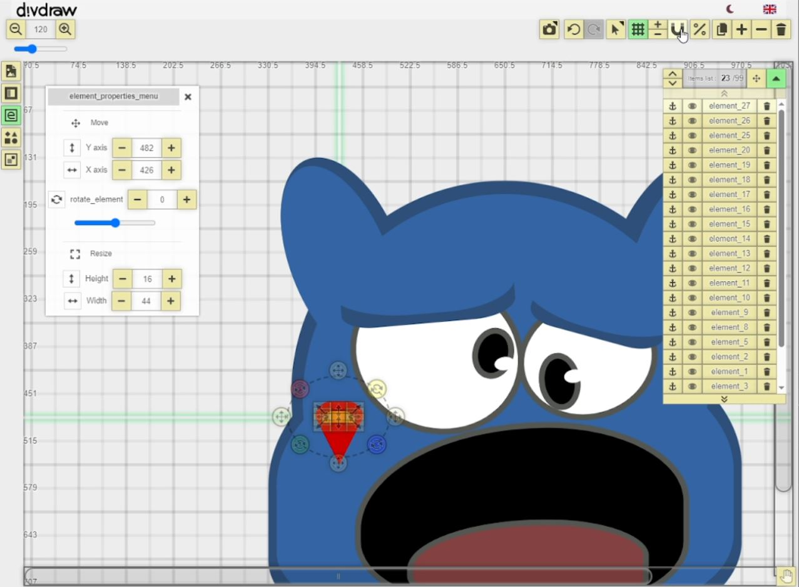

## Côté technique
Application Vue 3 sans backend : pas de base de données, pas d'API, aucun appel réseau. Tout vit dans le navigateur et dans le `localStorage`.

Le vrai sujet ici, c'était le JS, et plus précisément la trigonométrie. Redimensionner un carré bien droit, c'est trivial. Redimensionner la pointe d'un triangle incliné à 12,3° pendant qu'un zoom est actif, avec le magnétisme de la grille et la contrainte de symétrie par-dessus, ça l'est beaucoup moins : il faut ramener la position de la souris dans le repère local de la forme, appliquer la variation sur le bon axe, puis recalculer le décalage du centre pour que le côté opposé reste visuellement immobile. Le plan est découpé en huit secteurs angulaires, chacun avec sa propre correspondance entre poignée et axe de transformation. Beaucoup d'arrachage de cheveux pour que ça tombe juste, mais ça marche vraiment pas mal.

Aucune bibliothèque de dessin, aucune dépendance graphique tierce : toute la géométrie est écrite à la main.

Dernier gros projet frontend avant que je me consacre à mon système de frameworkisation de Laravel. J'en suis assez fier techniquement, même si il n'est pas terminé (et comporte encore quelques bugs), et je dois avouer que ce projet ne sert pas à grand-chose au final, pourquoi on voudrait faire des dessins avec des `div` dans un navigateur... ? Mais comme exercice front c'était bon terrain d'expérimentation.

**Stack** : Vue.js 3 (Vuex, Vue Router, vue-i18n), SASS

## Autres images
| Dessin ||
|---|---|
|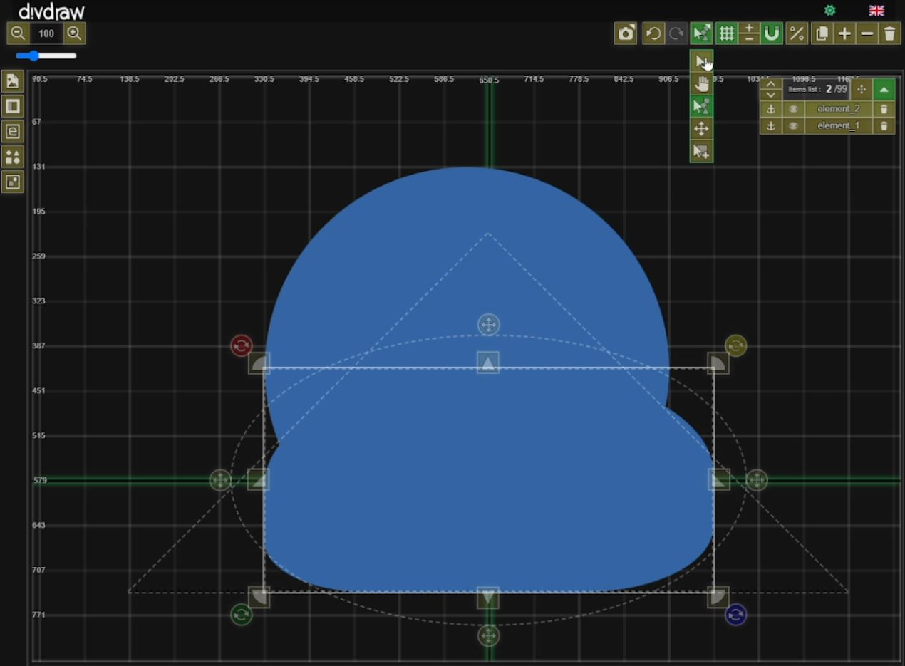|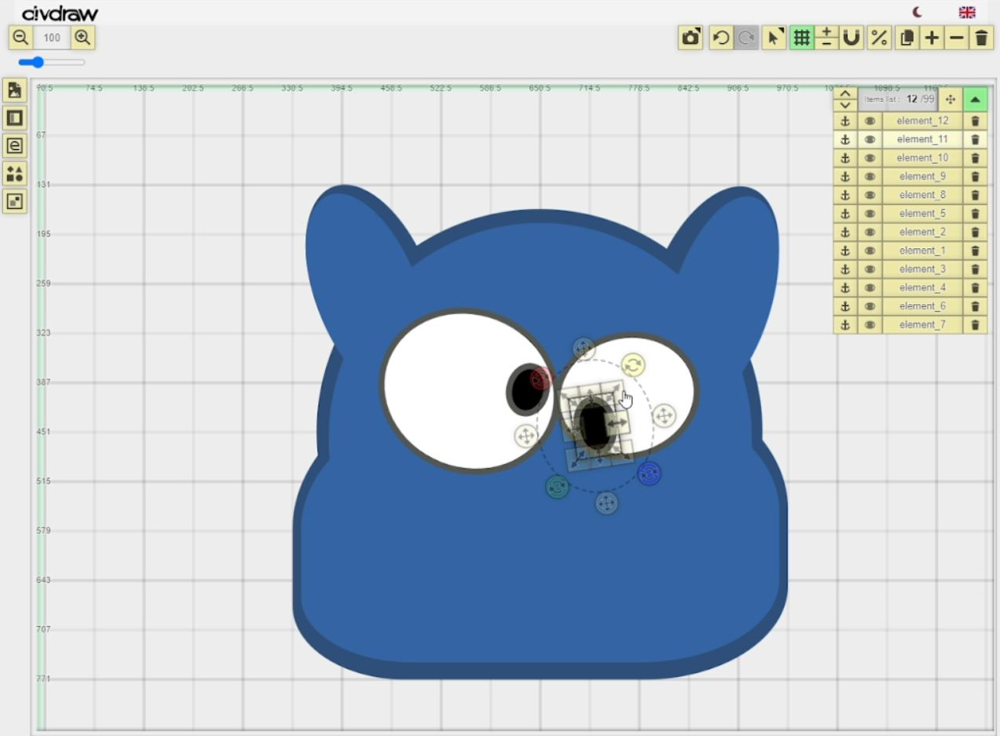|
|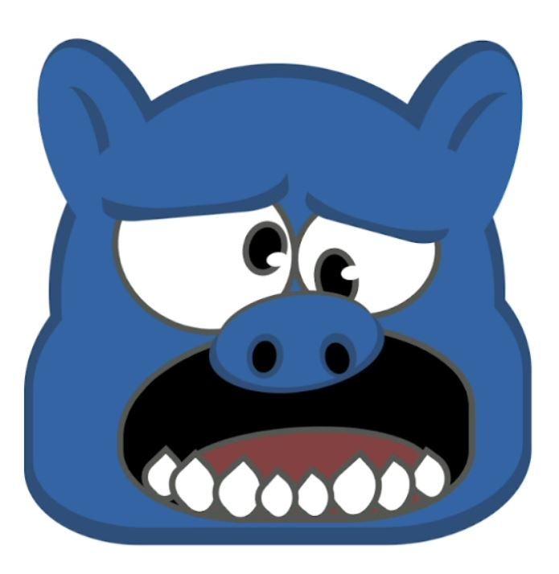||

| Dessin |||
|---|---|---|
|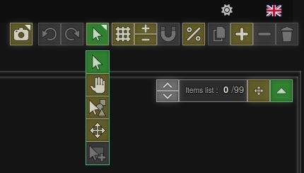|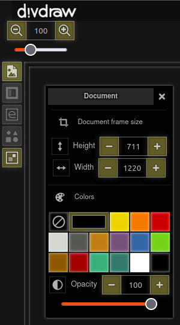|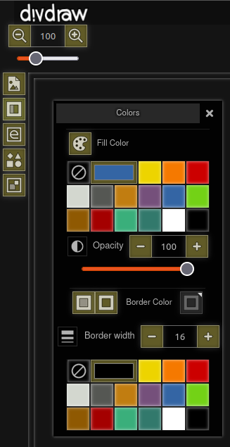|
|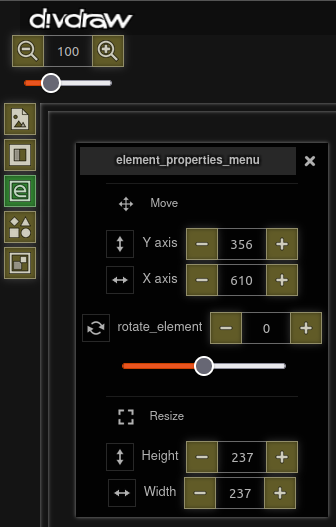|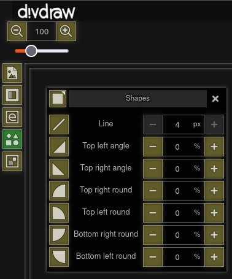|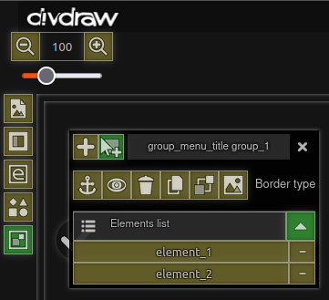|
|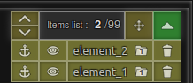|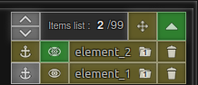||
